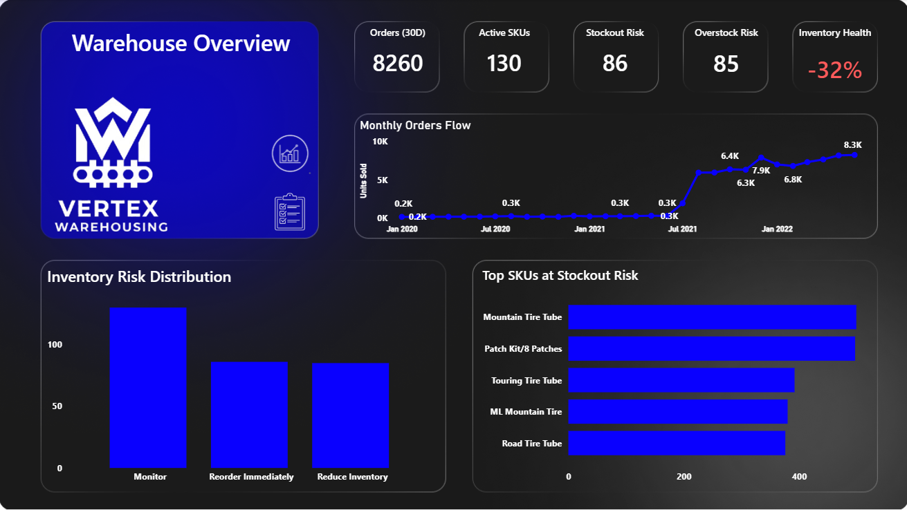
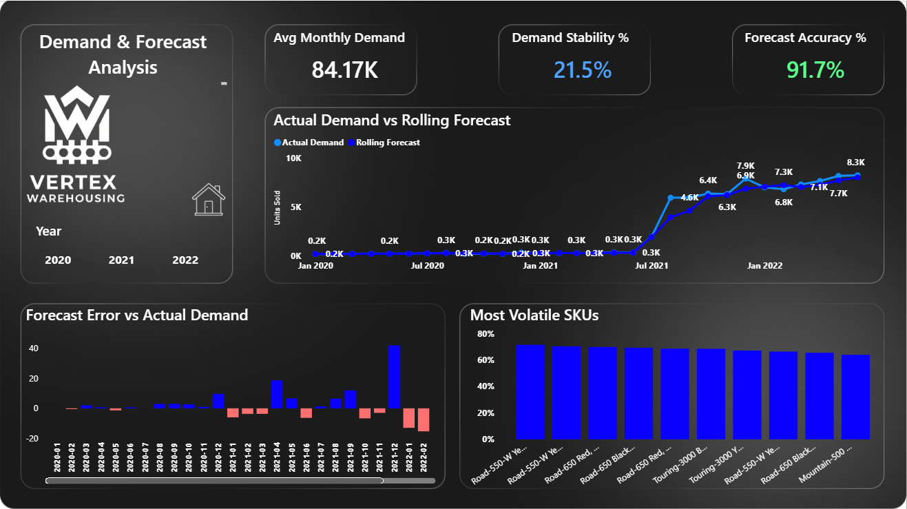
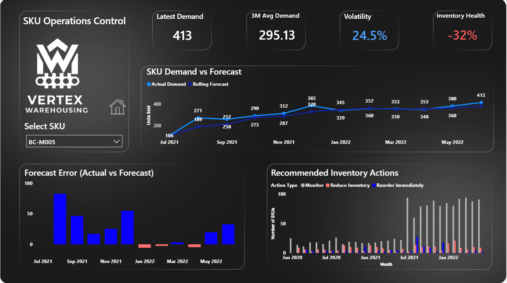

<p align="center">
  
  
  
  
</p>

---

# 🏭 Smart Warehouse Operations Dashboard
End-to-end Smart Warehouse Operations dashboard built with PostgreSQL & Power BI for demand forecasting, inventory risk, and SKU-level decision-making.
---

## 📌 Project Overview

This project simulates a **Smart Warehouse Operations Command Center** used by operations and supply chain teams to monitor demand, forecast inventory needs, and take proactive SKU-level actions.

The dashboard combines **historical sales data, rolling demand forecasts, risk classification, and inventory action logic** to support real-world warehouse decision-making such as:
- Preventing stockouts
- Reducing overstock
- Identifying volatile SKUs
- Improving forecast accuracy

---

## ❓ Business Questions Answered

- How is warehouse demand trending over time?
- Which SKUs are at **stockout risk** or **overstock risk**?
- How accurate are current demand forecasts?
- Which SKUs show the highest demand volatility?
- What inventory action should be taken for each SKU?
- What is the overall health of warehouse inventory?

---

## 🛠 Tools & Technologies

- **PostgreSQL** – Data modeling, aggregations, rolling demand logic
- **Power BI** – Interactive dashboards & DAX measures
- **DAX** – Forecast accuracy, inventory health, volatility metrics
- **Figma** – Custom dark-theme dashboard background

---

## 🗄 Dataset & Data Model

The project uses a star-schema-style warehouse dataset including:

- `fact_sales`
- `dim_product`
- `dim_customer`
- `dim_territory`
- `calendar`
- `returns_data`

Monthly aggregations and analytical logic are implemented through SQL views for efficient reporting.

---

## 📂 Project Structure
```
smart-warehouse-operations-dashboard/
│
├── sql/
│   └── warehouse_operations_views.sql
│
├── powerbi/
│   └── smart_warehouse_operations.pbix
│
├── screenshots/
│   ├── overview.png
│   ├── demand_forecast.png
│   ├── sku_control.png
│
└── README.md
```
---

## 📊 Dashboards Included

### 1️⃣ Warehouse Overview
- Orders (Last 30 Days)
- Active SKUs
- Stockout & Overstock Risk
- Inventory Health Score
- Monthly Orders Flow
- Inventory Risk Distribution

### 2️⃣ Demand & Forecast Analysis
- Actual Demand vs Rolling Forecast
- Forecast Accuracy %
- Demand Volatility
- Forecast Error Over Time
- Most Volatile SKUs

### 3️⃣ SKU Operations Control
- SKU-level demand trends
- Recommended inventory actions
- Forecast vs actual comparison
- Action distribution over time

---

## 🧮 Key DAX Measures

```DAX
Inventory Health Score =
VAR TotalSKUs =
    DISTINCTCOUNT(vw_warehouse_operations_monthly[product_sku])
VAR RiskSKUs =
    [Stockout Risk SKUs] + [Overstock Risk SKUs]
RETURN
ROUND( (1 - DIVIDE(RiskSKUs, TotalSKUs)) * 100, 0 )

Forecast Accuracy % = 
VAR MonthlyTable =
    SUMMARIZE(
        vw_warehouse_operations_monthly,
        vw_warehouse_operations_monthly[sales_month],
        "ActualDemand",
        SUM(vw_warehouse_operations_monthly[total_units_sold]),
        "ForecastDemand",
        SUM(vw_warehouse_operations_monthly[avg_3_month_demand])
    )

VAR TotalError =
    SUMX(
        MonthlyTable,
        ABS([ActualDemand] - [ForecastDemand])
    )

VAR TotalActual =
    SUMX(
        MonthlyTable,
        [ActualDemand]
    )

RETURN
MAX(
    0,
    1 - DIVIDE(TotalError, TotalActual)
)

Active SKUs = 
DISTINCTCOUNT(vw_warehouse_operations_monthly[product_sku])

Avg Monthly Demand = 
AVERAGEX(
    VALUES(vw_warehouse_operations_monthly[sales_month]),
    SUM(vw_warehouse_operations_monthly[total_units_sold])
)

Demand Stability % = 
VAR Volatility = [Demand Volatility %]
VAR MaxVolatility = 1.5   -- 150% volatility = 0 stability
RETURN
MAX(
    0,
    MIN(
        1,
        1 - (Volatility / MaxVolatility)
    )
)

Demand Volatility % = 
VAR MonthlyTable =
    SUMMARIZE(
        vw_warehouse_operations_monthly,
        vw_warehouse_operations_monthly[sales_month],
        "MonthlyDemand",
        SUM(vw_warehouse_operations_monthly[total_units_sold])
    )

VAR AvgDemand =
    AVERAGEX(MonthlyTable, [MonthlyDemand])

VAR DemandStdDev =
    STDEVX.P(MonthlyTable, [MonthlyDemand])

RETURN
DIVIDE(DemandStdDev, AvgDemand)

Forecast Error = 
SUM(vw_warehouse_operations_monthly[total_units_sold])
- SUM(vw_warehouse_operations_monthly[avg_3_month_demand])

Forecast Error Color = 
IF (
    [Forecast Error] >= 0,
    "#0900FF",   -- blue
    "#FF7070"    -- red
)

Inventory Health % = 
VAR TotalSKUs =
    DISTINCTCOUNT(vw_warehouse_operations_monthly[product_sku])

VAR RiskSKUs =
    [Stockout Risk SKUs] + [Overstock Risk SKUs]

RETURN
1 - DIVIDE(RiskSKUs, TotalSKUs)

Orders (Last 30 Days) = 
CALCULATE(
    SUM(vw_warehouse_operations_monthly[total_units_sold]),
    DATESINPERIOD(
        vw_warehouse_operations_monthly[sales_month],
        MAX(vw_warehouse_operations_monthly[sales_month]),
        -30,
        DAY
    )
)

Overstock Risk SKUs = 
CALCULATE(
    DISTINCTCOUNT(vw_warehouse_operations_monthly[product_sku]),
    vw_warehouse_operations_monthly[overstock_risk] = 1
)

Stockout Risk SKUs = 
CALCULATE(
    DISTINCTCOUNT(vw_warehouse_operations_monthly[product_sku]),
    vw_warehouse_operations_monthly[stockout_risk] = 1
)

```

---

## 🚀 How to Run This Project

You can either explore the Power BI dashboard directly or recreate the full SQL → Power BI pipeline.

---

### ✅ Option 1 – Open the Power BI report only

1. Download `smart_warehouse_operations.pbix` from this repository.
2. Open it using **Power BI Desktop**.
3. If the data connection fails:
   - You can still explore the existing visuals, or  
   - Re-point the data source to your own PostgreSQL database.

---

### ✅ Option 2 – Rebuild the full SQL + Power BI pipeline

1. **Create a PostgreSQL database**:

   ```sql
   CREATE DATABASE warehouse_operations;
   ```
2. **Create or reuse base tables**:
   - fact_sales
   - dim_product
   - calendar
   - (optional) return_data, dim_customer, dim_territory
3. **Run the SQL script from the /sql folder**:
   ```sql
       warehouse_operations_views.sql
   ```
This script creates all reporting views used by the dashboard, including:
   - Monthly demand aggregation at SKU level
   - Rolling 3-month demand forecasts
   - Demand volatility calculations
   - Stockout and overstock risk flags
   - Recommended inventory actions
   - Inventory health metrics
4. Open the Power BI file and connect it to the PostgreSQL database.
5. Refresh the data to load:
   - Demand trends
   - Forecast vs actual analysis
   - Inventory risk insights
   - SKU-level operational recommendations
   
---

## 🖼 Dashboard Screenshots

### Warehouse Overview


### Demand & Forecast Analysis


### SKU Operations Control


---

## 📈 Key Insights & Findings

### 🔹 Demand Trends
- Warehouse demand increased sharply after mid-2021, reaching **8K+ monthly units**
- Recent demand remains consistently high, indicating sustained growth

### 🔹 Inventory Risk
- **86 SKUs** identified at stockout risk
- **85 SKUs** flagged for overstock
- Overall inventory health score is **negative**, highlighting imbalance

### 🔹 Forecast Performance
- Forecast accuracy reached **91.7%**, indicating strong predictive performance
- High volatility SKUs exceed **60% demand fluctuation**, requiring closer monitoring

### 🔹 Business Impact
- Early risk detection enables proactive reordering
- Overstock reduction opportunities identified for low-demand SKUs
- SKU-level control supports smarter warehouse decisions

---

## 📬 Contact

**Author:** Shohag  

If you’d like to discuss this project, collaborate, or talk about data analyst roles:

- 💼 LinkedIn: [NURA ALAM SHOHAG](https://www.linkedin.com/in/dataanalystshohag/)
- 🧑‍💻 GitHub: [Shohag-DataAnalyst](https://github.com/Shohag-DataAnalyst)

